# 🩺 Vårdappen – Frontend (Vue 3 + Vite)

This is the frontend part of **Vårdappen** – a Vue 3-based interface for patients and doctors, supporting OTP login, appointment booking, and AI-powered chat (via OpenAI).

---

## 🧭 Table of Contents

- [📱 Features](#-features)  
- [⚙️ Tech Stack](#-tech-stack)  
- [📁 Project Structure](#-project-structure)  
- [🚀 Installation & Run](#-installation--run)  
- [💬 Chat](#-chat)  
- [📄 License](#-license)

---

## 🩺 Vårdappen – Book Doctor Appointments Easily with OTP Login

**Vårdappen** is a Vue 3 + Express.js-based web application where patients can register, log in using a one-time password (OTP), and book video appointments with doctors.

---

## Info

All backend and frontend updates have been verified and deployed. The backend runs on Railway, and both backend and frontend are deployed via Vercel.

🧪 **Doctor login demo code**: `123456`

🔐 Login works via SMS-based OTP. Enter your phone number:
- If the number is new → you will be prompted to register
- If the number already exists → login directly with OTP

👉 [Try the app on Vercel](https://app-care.vercel.app/)

---

## 📱 Booking Flow

A walkthrough of the booking flow in Vårdappen with screenshots:

### 👋 Start & Login
- Start screen – App intro & choice
- Login – Enter phone number
- Register – If phone not found
  
<p align='center'>
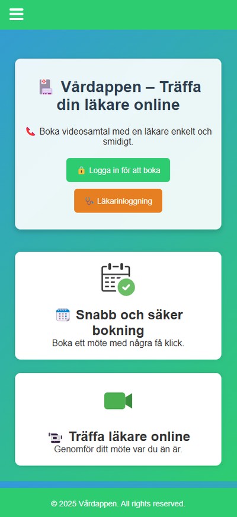
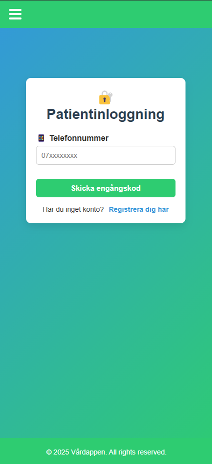
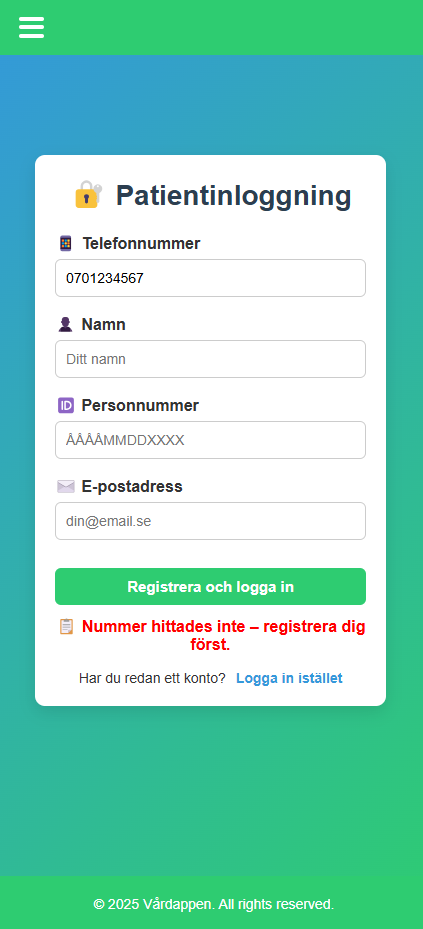
</p>

### ✅ OTP Verification
- Enter one-time SMS code  
- Fill out booking form with date/time  
- Confirmation & video link sent by email  

<p align='center'>
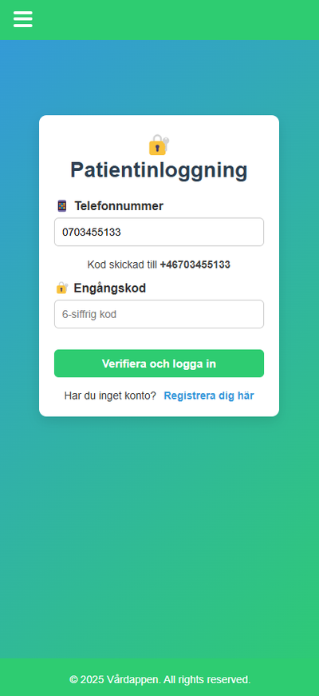
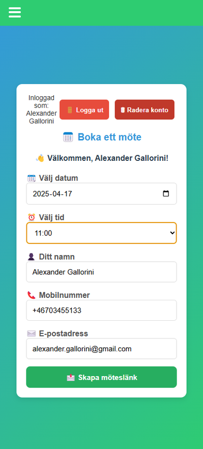
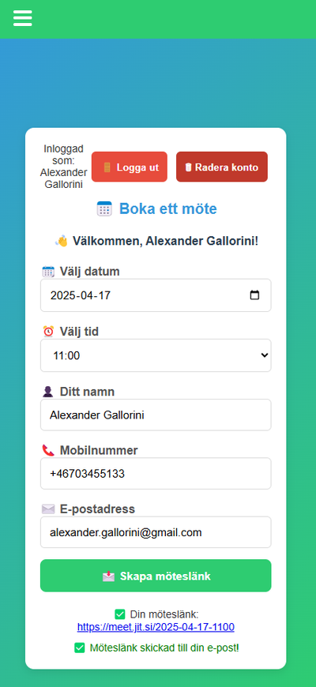
</p>

### 📋 Navigation & Admin Panel  
- Navigation menu between views  
- Jitsi video meeting via link  
- Doctor login (admin only)  

<p align='center'>
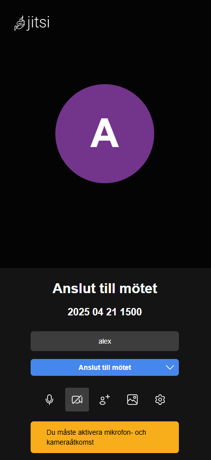
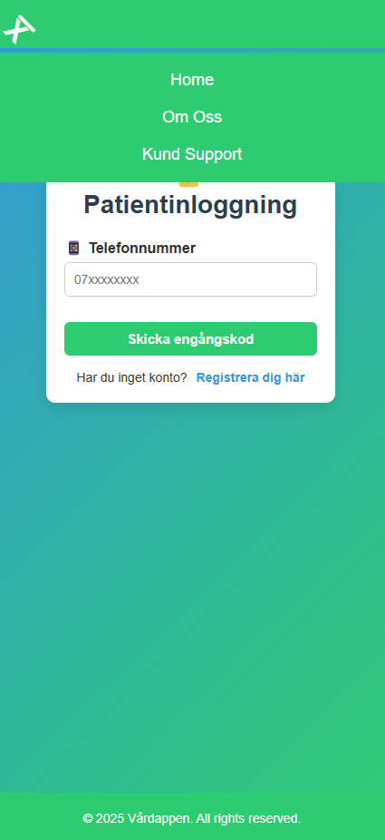
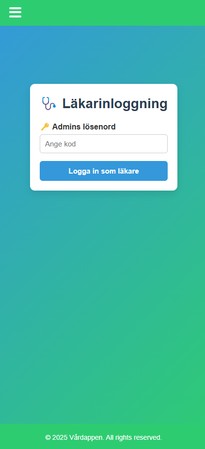

</p>

### 🗂️ Doctor Panel  
- View, edit, delete bookings  
- Sort by upcoming/past  
- Change booking times 

<p align='center'>
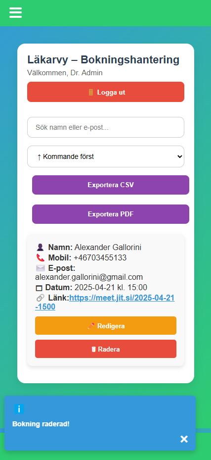
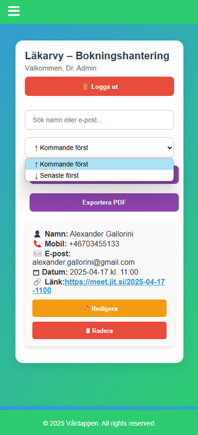
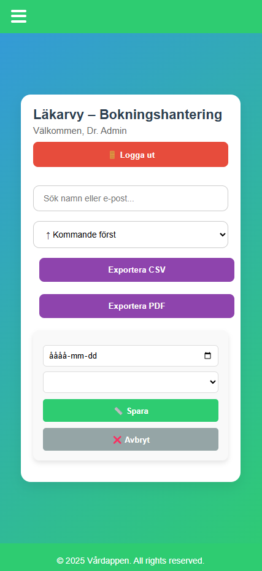

</p>


### 📄 Exported PDF – Example  
<p align='center'>
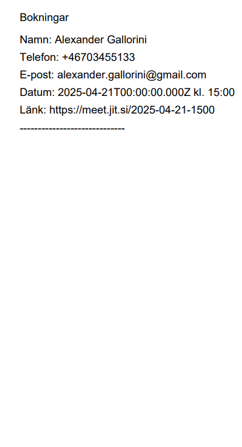
</p>

---

## 📱 Features

- 🔐 OTP login via SMS  
- 📝 Patient registration with name, email, and SSN  
- 📅 Book video appointments (Jitsi)  
- 📧 Email confirmation via Brevo  
- 💬 Built-in AI chat (GPT-3.5) via `Support.vue`  
- 🔔 Toast messages with sound (info/success/error)  
- 👨‍⚕️ Doctor view for booking management  
- 📦 Export bookings to PDF

---

## ⚙️ Tech Stack

| Part         | Technology             |
|--------------|------------------------|
| UI Framework | Vue 3                  |
| Tooling      | Vite                   |
| Routing      | Vue Router             |
| Audio Alerts | Custom `useToastSound` |
| HTTP Client  | Native `fetch()`       |
| Chat         | OpenAI GPT-3.5 (via backend)

---
## 📁 Project Structure

```
src/
├── assets/
├── components/
│   ├── DoctorCard.vue
│   ├── Footer.vue
│   ├── Navbar.vue
│   └── Toast.vue
├── composables/
│   └── useToastSound.js
├── services/
│   └── api.js
├── views/
│   ├── About.vue
│   ├── BookingView.vue
│   ├── DoctorLogin.vue
│   ├── DoctorView.vue
│   ├── Home.vue
│   ├── NotFoundView.vue
│   ├── PatientLogin.vue
│   ├── Support.vue ✅
│   └── Video.vue
├── App.vue
├── main.js
├── router.js
├── style.css
```

📂 Other:
- `public/sounds/`: includes success, error, info sounds  
- `vite.config.js`: Vite build config  
- `index.html`: app entry file for Vite

---

## 🚀 Installation & Run

```bash
# Clone the project
git clone https://github.com/your-repo/AppCare.git
cd AppCare

# Navigate to frontend folder
cd frontend

# Install dependencies
npm install

# Start dev server
npm run dev
```
---

## 💬 Chat

### Features:
- Implemented in `Support.vue`
- Uses OpenAI API via backend (`/api/chat`)
- If user is logged in, chat is saved to the database
- If not logged in, chat is stored temporarily in `localStorage`

### Sounds:
- All chat replies are played with sound via `useToastSound.js`

---

## 📄 License

Frontend © 2025 Alexander Gallorini & Filip Kostic – IT University