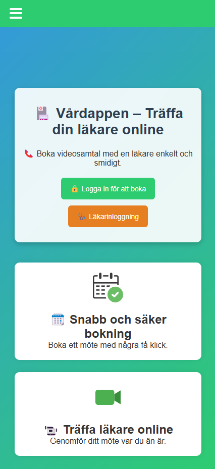

## 🧭 Innehåll

- [🩺 Vårdappen – Boka läkarmöte enkelt med OTP-inloggning](#-vårdappen--boka-läkarmöte-enkelt-med-otp-inloggning)
- [Info](#info)
- [Vårdappen – Bokningsflöde 📱💬](#vårdappen--bokningsflöde-)
    - [](#)
    - [](#-1)
    - [](#-2)
    - [](#-3)
    - [](#-4)
    - [📄 Exporterat innehåll – Exempel på genererad PDF](#-exporterat-innehåll--exempel-på-genererad-pdf)
  - [✅ Funktioner](#-funktioner)
  - [⚙️ Teknikstack](#️-teknikstack)
  - [📁 Projektstruktur](#-projektstruktur)
  - [🛠️ Installation](#️-installation)
  - [🗺 ER-Diagram](#-er-diagram)
  - [🧮 Databasstruktur (MySQL)](#-databasstruktur-mysql)
  - [Database Connection to MySql (db.js)](#database-connection-to-mysql-dbjs)
    - [Tabeller:](#tabeller)
  - [🔌 API-rutter (Express)](#-api-rutter-express)
    - [Patienter:](#patienter)
    - [OTP:](#otp)
    - [Läkare:](#läkare)
    - [Bokningar:](#bokningar)
  - [📄 Licens](#-licens)

---

# 🩺 Vårdappen – Boka läkarmöte enkelt med OTP-inloggning

Vårdappen är en Vue 3 + Express.js-baserad webbtjänst där patienter kan registrera sig, logga in med engångskod (OTP), och boka videomöten med läkare.

# Info

All backend and frontend updates have been checked and completed. The project is hosted on Railway for the server, and both the project and the Railway server are deployed on Vercel, so everything is working fine.

For the doctor admin demo, the password is 123456.

The login function works via OTP SMS code. You enter your phone number, and if the authentication system detects that an account hasn’t been created with that number yet, you’ll be asked to enter your details — this means it’s your first time logging in. The next time, you can log in directly using just your phone number and the SMS code.

Here is the Vercel website where you can test the app:
👉 https://app-care.vercel.app/

---

---

# Vårdappen – Bokningsflöde 📱💬

Här är en genomgång av bokningsflödet i vårdappen, steg för steg med tillhörande skärmbilder:

### 
📄 Startskärm – Vårdappen introduktion och val 

🔐 Inloggning – Ange telefonnummer 

📝 Registrering – Om numret inte finns
<p align='center'>



</p>

###

✅ Kodverifiering – Ange engångskod

📅 Bokningsformulär – Välj datum och tid

🔗 Möteslänk genererad – Bekräftelse på skärm och e-post

<p align='center'>


</p>


### 


### 

📋 Meny – Navigera mellan sidor

🎥 Jitsi möte – Videomöte via möteslänk

👨‍⚕️ Läkarinloggning – Endast för administratörer

<p align='center'>


</p>

### 


🗂️ Läkarpanel – Bokningar med redigering och radering

🔃 Sortering – Välj sorteringsordning för bokningar

⏰ Läkarvy – Redigera tid för befintlig bokning

<p align='center'>


</p>


### 📄 Exporterat innehåll – Exempel på genererad PDF
<p align='center'>

</p>

---

## ✅ Funktioner

- 📱 OTP-inloggning via telefonnummer
- 📝 Patientregistrering med personnummer och e-post
- 📅 Tidsbokning med datum och tid
- 🔗 Automatisk möteslänk (Jitsi)
- 📧 E-postbekräftelse (via Brevo API)
- 🔐 Konto-radering och skyddad inloggning

---

## ⚙️ Teknikstack

| Del         | Teknik                        |
|-------------|-------------------------------|
| Frontend    | Vue 3, Vue Router, Vite       |
| Backend     | Node.js, Express.js           |
| Databas     | MySQL                         |
| SMS         | Brevo (Transactional SMS API) |
| E-post      | Brevo (SMTP API)              |

---

## 📁 Projektstruktur

```
AppCare/
├── Beckend/
│   ├── controllers/
│   │   ├── authController.js
│   │   ├── bookingController.js
│   │   └── patientsController.js
│   ├── routes/
│   │   ├── auth.js
│   │   ├── bookings.js
│   │   ├── doctors.js
│   │   └── patients.js
│   ├── utils/sendSMS.js
│   ├── db.js
│   ├── app.js
│   ├── booking-mysql.txt
│   └── package.json
├── public/
│   ├── sounds/
│   │   ├── success.mp3
│   │   ├── error.mp3
│   │   └── info.mp3
│   └── vite.svg
├── src/
│   ├── assets/
│   ├── components/
│   │   ├── DoctorCard.vue
│   │   ├── Footer.vue
│   │   ├── Navbar.vue
│   │   └── Toast.vue
│   ├── composables/useToastSound.js
│   ├── services/api.js
│   ├── views/
│   │   ├── About.vue
│   │   ├── BookingView.vue
│   │   ├── DoctorLogin.vue
│   │   ├── DoctorView.vue
│   │   ├── Home.vue
│   │   ├── NotFoundView.vue
│   │   ├── PatientLogin.vue
│   │   ├── Support.vue
│   │   └── Video.vue
│   ├── App.vue
│   ├── main.js
│   ├── router.js
│   └── style.css
│
├── index.html
├── package.json
├── server.js
├── vite.config.js
├── index.html
└── README.md
```

---

## 🛠️ Installation

```bash
git clone https://github.com/ditt-repo/AppCare.git
cd AppCare

# Backend
cd backend
npm install
node app.js

# Frontend (i separat terminal)
cd frontend
npm install
npm run dev
```


## 🗺 ER-Diagram


> Diagrammet visar relationen mellan patienter, läkare, bokningar och OTP-tabellen.

---

---

## 🧮 Databasstruktur (MySQL)

## Database Connection to MySql (db.js)

- DB_HOST=localhost
- DB_USER=root
- DB_PASSWORD=your_password_here
- DB_NAME=booking_db

### Tabeller:
- `Patients`: namn, telefon, personnummer, e-post
- `Doctors`: namn, kod för inloggning
- `Bookings`: datum, tid, möteslänk, patient_id (FK)
- `OTPs`: telefon, kod, utgångsdatum

```sql
-- 🛠️ Skapa databas
CREATE DATABASE IF NOT EXISTS booking_db;
USE booking_db;

-- 👤 Patients-tabell
CREATE TABLE IF NOT EXISTS Patients (
  id BIGINT AUTO_INCREMENT PRIMARY KEY,
  name VARCHAR(100) NOT NULL,
  phone VARCHAR(20) NOT NULL UNIQUE,
  ssn VARCHAR(20) NOT NULL UNIQUE,
  email VARCHAR(100) NOT NULL UNIQUE
);

-- 👨‍⚕️ Doctors-tabell
CREATE TABLE IF NOT EXISTS Doctors (
  id INT AUTO_INCREMENT PRIMARY KEY,
  name VARCHAR(100) NOT NULL,
  phone VARCHAR(20),
  ssn VARCHAR(12),
  code VARCHAR(10) NOT NULL UNIQUE
);

-- 📅 Bookings-tabell
CREATE TABLE IF NOT EXISTS Bookings (
  id BIGINT AUTO_INCREMENT PRIMARY KEY,
  date DATE NOT NULL,
  time VARCHAR(10) NOT NULL,
  meetingLink TEXT NOT NULL,
  patient_id BIGINT NOT NULL,
  FOREIGN KEY (patient_id) REFERENCES Patients(id) ON DELETE CASCADE
);

-- 🔐 OTP-tabell
CREATE TABLE IF NOT EXISTS OTPs (
  id INT AUTO_INCREMENT PRIMARY KEY,
  phone VARCHAR(20) NOT NULL UNIQUE,
  code VARCHAR(10) NOT NULL,
  expires_at DATETIME NOT NULL
);

-- Test & Verktygskoder

-- 👨‍⚕️ Dummy-läkare
INSERT INTO Doctors (name, phone, ssn, code)
VALUES ('Dr. Admin', '0700000000', '190001019999', '123456')
ON DUPLICATE KEY UPDATE code = '123456';

-- 🧹 Rensa gamla OTP:er som har fel format
DELETE FROM OTPs WHERE phone NOT LIKE '+46%';

-- 🔍 Testa olika selekteringar
SELECT * FROM OTPs ORDER BY id DESC;
SELECT * FROM Patients;
SELECT * FROM Patients WHERE phone LIKE '%3455133';
SELECT * FROM Patients WHERE ssn = '198812219759';

-- 🔍 Visa bokningar med patientinfo
SELECT
  b.id, b.date, b.time, b.meetingLink,
  p.name, p.phone, p.email
FROM Bookings b
JOIN Patients p ON b.patient_id = p.id;

-- 🔄 Konvertera telefonnummer till +46-format (en gång)
UPDATE Patients
SET phone = CONCAT('+46', SUBSTRING(phone, 2))
WHERE phone LIKE '07%';

-- 📌 Kontrollera koppling till bokningar innan DELETE
SELECT * FROM Bookings WHERE patient_id = (
  SELECT id FROM Patients WHERE phone = '+46703455133'
);

-- 🧪 Sätt in testperson
INSERT INTO Patients (name, phone, ssn, email)
VALUES ('Testperson', '+46703455133', '199001019999', 'test@example.com');

-- 🧽 Ta bort testanvändare
DELETE FROM Patients WHERE phone = '+46703455133';
DELETE FROM OTPs WHERE phone = '+46703455133';

```

---

## 🔌 API-rutter (Express)

### Patienter:
- `POST /api/patients/register`
- `POST /api/patients/login`
- `DELETE /api/patients/:id`
- `POST /api/patients/check-phone`

### OTP:
- `POST /api/otp/send`
- `POST /api/otp/verify`

### Läkare:
- `POST /api/doctors/login`

### Bokningar:
- `GET /api/bookings/available-times?date=YYYY-MM-DD`
- `POST /api/bookings`
- `DELETE /api/bookings/:id`

---

## 📄 Licens

Grupprojekt © 2025 Alexander Gallorini - Filip Kostic / ITHS - Högskolan
